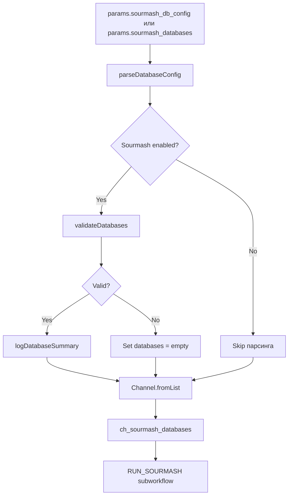

# Лог выполнения задачи 1.2: Парсинг конфигурации баз данных

**Дата:** 23 октября 2025  
**Задача:** Фаза 1, Задача 1.2 - Парсинг конфигурации баз данных  
**Статус:** ✅ Выполнено

---

## Цель задачи

Создать Groovy-скрипт для парсинга конфигурации баз данных Sourmash из двух источников:
- Nextflow config файла (`params.sourmash_databases`)
- CSV файла (`params.sourmash_db_config`)

Интегрировать парсер в workflow `ascc_genomic.nf` для создания канала баз данных.

---

## Выполненные изменения

### 1. Создан Groovy-класс SourmashDatabaseConfig

**Файл:** `/Users/dz11/github/ascc/lib/SourmashDatabaseConfig.groovy`  
**Размер:** 245 строк

**Реализованные методы:**

#### 1.1. `parseDatabaseConfig(params)` - Основной метод парсинга
- Проверяет наличие `params.sourmash_db_config` (CSV файл)
- Если CSV не указан, использует `params.sourmash_databases`
- Возвращает List<Map> с конфигурацией баз данных
- Возвращает пустой список если нет конфигурации

**Приоритет:** CSV > params.sourmash_databases

#### 1.2. `parseDatabasesFromCSV(csvPath)` - Парсинг CSV файла
- Читает CSV файл построчно
- Пропускает заголовок (первая строка)
- Парсит 6 полей: name, path, k_available, k_for_search, s, assembly_taxa_db
- Обрабатывает `k_available` в формате `"[21,31,51]"`
- Возвращает List<Map> с конфигурациями
- Логирует warning для некорректных строк

**Формат CSV:**
```csv
name,path,k_available,k_for_search,s,assembly_taxa_db
vertebrate_k51,/prod/vertebrate.zip,"[31,51]",51,200,/prod/assembly_taxa_vertebrate.csv
```

#### 1.3. `validateDatabases(databases)` - Валидация конфигурации
Проверяет:
- Наличие хотя бы одной базы данных
- Отсутствие дубликатов имен баз
- Существование файлов баз данных
- Существование файлов `assembly_taxa_db`
- Соответствие `k_for_search` списку `k_available`
- Корректность параметра `s` (scaled > 0)

**Возвращает:**
```groovy
[
    valid: boolean,      // true если все проверки пройдены
    warnings: List<String>  // список предупреждений
]
```

#### 1.4. `collectUniqueK(databases)` - Сбор уникальных k
- Собирает все значения `k_for_search` из всех баз
- Удаляет дубликаты
- Сортирует по возрастанию
- Используется для генерации параметров sketch

**Пример:** Базы с k=51, k=31, k=21 → `[21, 31, 51]`

#### 1.5. `getMinimumScaled(databases)` - Минимальное scaled
- Находит минимальное значение `s` среди всех баз
- Используется для sketch (должен покрывать все базы)

**Пример:** Базы с s=200, s=200, s=1000 → `200`

#### 1.6. `generateSketchParams(databases)` - Генерация параметров sketch
- Формирует строку для `task.ext.args` модуля `SOURMASH_SKETCH`
- Объединяет результаты `collectUniqueK` и `getMinimumScaled`

**Формат выхода:**
```
"dna --param-string 'scaled=200,k=21,k=31,k=51'"
```

#### 1.7. `checkDuplicateTaxaDB(databases)` - Проверка дубликатов assembly_taxa_db
- Ищет базы, использующие один и тот же файл `assembly_taxa_db`
- Возвращает список дублирующихся путей
- Используется для warning (не критичная ошибка)

#### 1.8. `getUniqueTaxaDBPaths(databases)` - Уникальные пути taxa DB
- Возвращает список уникальных путей к `assembly_taxa_db`
- Используется если необходимо merge несколько taxa DB

#### 1.9. `logDatabaseSummary(databases)` - Логирование сводки
- Выводит информацию о загруженных базах данных
- Показывает параметры sketch (k и scaled)
- Предупреждает о дублирующихся `assembly_taxa_db`

**Пример вывода:**
```
[ASCC Sourmash] Loaded 3 database configuration(s):
  - vertebrate_k51: k=51, s=200
    DB: /prod/vertebrate.zip
    Taxa: /prod/assembly_taxa_vertebrate.csv
  - invertebrate_k31: k=31, s=200
    DB: /prod/invertebrate.zip
    Taxa: /prod/assembly_taxa_invertebrate.csv
  - virus_k21: k=21, s=1000
    DB: /prod/virus.zip
    Taxa: /prod/assembly_taxa_virus.csv
[ASCC Sourmash] Sketch parameters: k=[21, 31, 51], scaled=200
```

#### 1.10. `parseKArrayFromString(kString)` - Вспомогательная функция
- Парсит строку типа `"[21,31,51]"` в List<Integer>
- Удаляет скобки, разбивает по запятой
- Конвертирует в integers

---

### 2. Интеграция в workflow

**Файл:** `/Users/dz11/github/ascc/workflows/ascc_genomic.nf`  
**Изменения:** Добавлены строки 65-96, 138-162

#### 2.1. Инициализация парсера (после `main:`)

```groovy
//
// LOGIC: PARSE SOURMASH DATABASE CONFIGURATION
//
def sourmashConfig = new SourmashDatabaseConfig()
def sourmash_databases = sourmashConfig.parseDatabaseConfig(params)

// Validate databases if Sourmash is enabled
if (params.run_sourmash == "both" || params.run_sourmash == "genomic") {
    if (sourmash_databases.size() > 0) {
        def validation = sourmashConfig.validateDatabases(sourmash_databases)
        
        // Log warnings
        validation.warnings.each { warning ->
            log.warn "[ASCC Sourmash] ${warning}"
        }
        
        // Log summary if valid
        if (validation.valid) {
            sourmashConfig.logDatabaseSummary(sourmash_databases)
        } else {
            log.error "[ASCC Sourmash] Database validation failed. Sourmash will be skipped."
            sourmash_databases = []
        }
    } else {
        log.warn "[ASCC Sourmash] No Sourmash databases configured. Sourmash will be skipped."
    }
}

// Create channel for Sourmash databases
ch_sourmash_databases = Channel.fromList(sourmash_databases)
```

**Особенности:**
- Парсинг выполняется один раз при запуске workflow
- Валидация запускается только если `params.run_sourmash` включен
- Если валидация не прошла → список баз обнуляется → Sourmash skip
- Канал `ch_sourmash_databases` создается из списка конфигураций

#### 2.2. Обновление секции RUN_SOURMASH

**До:**
```groovy
ch_dbs = Channel.empty()
RUN_SOURMASH (
    sourmash_reference,
    ch_dbs
)
```

**После:**
```groovy
// Only run if databases are configured and validated
if (sourmash_databases.size() > 0) {
    reference_tuple_from_GG
        .map { meta, file ->
            def meta2 = [] // Inject meta data for sourmash runs
            [meta2, file]
        }
        .set { sourmash_reference }

    RUN_SOURMASH (
        sourmash_reference,
        ch_sourmash_databases
    )

    // This will be used for btk input if we decide to go that route
    ch_sourmash         = Channel.of( [[],[]] )
    ch_versions         = ch_versions.mix(RUN_SOURMASH.out.versions)
} else {
    log.warn "[ASCC Sourmash] Skipping Sourmash: no valid databases configured"
    ch_sourmash         = Channel.of( [[],[]] )
}
```

**Изменения:**
- Добавлена дополнительная проверка `sourmash_databases.size() > 0`
- Используется `ch_sourmash_databases` вместо `Channel.empty()`
- Добавлен warning при skip из-за отсутствия баз

---

## Поток данных



---

## Error Handling

### 1. Отсутствие конфигурации
**Условие:** `params.sourmash_databases = []` и `params.sourmash_db_config = null`  
**Действие:**
```
[ASCC Sourmash] No Sourmash databases configured. Sourmash will be skipped.
```
- Sourmash не запускается
- Workflow продолжается без ошибок

### 2. CSV файл не найден
**Условие:** Указан `params.sourmash_db_config`, но файл не существует  
**Действие:**
```
[ASCC Sourmash] CSV configuration file not found: <path>
```
- Возвращается пустой список
- Sourmash skip с warning

### 3. Файл базы данных не найден
**Условие:** База указана в конфигурации, но файл не существует  
**Действие:**
```
[ASCC Sourmash] Database file not found: <name> at <path>
[ASCC Sourmash] Database validation failed. Sourmash will be skipped.
```
- `validation.valid = false`
- Sourmash skip

### 4. Некорректный k_for_search
**Условие:** `k_for_search` не входит в `k_available`  
**Действие:**
```
[ASCC Sourmash] k_for_search (51) not in k_available [21, 31] for database vertebrate_k51
```
- Warning, но не блокирует выполнение
- Пользователь должен проверить конфигурацию

### 5. Дубликаты assembly_taxa_db
**Условие:** Несколько баз используют один файл `assembly_taxa_db`  
**Действие:**
```
[ASCC Sourmash] Multiple databases share the same assembly_taxa_db: /prod/assembly_taxa.csv
```
- Warning, не критично
- Может быть легитимной конфигурацией

### 6. Некорректная строка в CSV
**Условие:** Строка в CSV не содержит 6 полей  
**Действие:**
```
[ASCC Sourmash] Skipping malformed line 3 in CSV: <line>
```
- Строка пропускается
- Парсинг продолжается

---

## Примеры использования

### Пример 1: Конфигурация через params.sourmash_databases

**В файле `conf/production.config`:**
```groovy
params.sourmash_databases = [
    [
        name: 'vertebrate_k51',
        path: '/lustre/scratch126/tol/teams/bge/sourmash/vertebrate.zip',
        k_available: [31, 51],
        k_for_search: 51,
        s: 200,
        assembly_taxa_db: '/lustre/scratch126/tol/teams/bge/sourmash/assembly_taxa_vertebrate.csv'
    ],
    [
        name: 'invertebrate_k31',
        path: '/lustre/scratch126/tol/teams/bge/sourmash/invertebrate.zip',
        k_available: [31, 51],
        k_for_search: 31,
        s: 200,
        assembly_taxa_db: '/lustre/scratch126/tol/teams/bge/sourmash/assembly_taxa_invertebrate.csv'
    ]
]
```

**Результат:**
- Sketch с параметрами: `scaled=200, k=31, k=51`
- Два параллельных multisearch (для каждой базы со своим k)

### Пример 2: Конфигурация через CSV

**CSV файл (`sourmash_databases_production.csv`):**
```csv
name,path,k_available,k_for_search,s,assembly_taxa_db
vertebrate_k51,/prod/vertebrate.zip,"[31,51]",51,200,/prod/assembly_taxa_vertebrate.csv
invertebrate_k31,/prod/invertebrate.zip,"[31,51]",31,200,/prod/assembly_taxa_invertebrate.csv
virus_k21,/prod/virus.zip,"[21,31]",21,1000,/prod/assembly_taxa_virus.csv
```

**В командной строке:**
```bash
nextflow run main.nf \
    --sourmash_db_config sourmash_databases_production.csv \
    --run_sourmash genomic
```

**Результат:**
- Sketch с параметрами: `scaled=200, k=21, k=31, k=51` (min s = 200)
- Три параллельных multisearch (каждая база со своим k)

---

## Тестирование

### Локальное тестирование (запланировано)

**Тестовая конфигурация:**
```groovy
// assets/sourmash_testing/nextflow.config
params.sourmash_databases = [
    [
        name: 'gtdb_batch_1_k21',
        path: "${projectDir}/db/gtdb_k21_k31_k51_s200_batch_1.zip",
        k_available: [21, 31, 51],
        k_for_search: 21,
        s: 200,
        assembly_taxa_db: "${projectDir}/db/ascc_sourmash_test_subset_taxa.csv"
    ]
]
```

**Команда запуска:**
```bash
cd /Users/dz11/github/ascc
nextflow run main.nf \
    -c assets/sourmash_testing/nextflow.config \
    --input samplesheet.csv \
    --run_sourmash genomic
```

**Ожидаемое поведение:**
1. Парсинг конфигурации из `nextflow.config`
2. Валидация файлов базы данных
3. Логирование сводки баз данных
4. Создание sketch с k=21, scaled=200
5. Запуск multisearch с k=21

---

## Технические детали

### Формат данных в канале ch_sourmash_databases

**Структура:**
```groovy
[
    [
        name: String,              // Имя базы данных
        path: String,              // Путь к .zip или .rocksdb файлу
        k_available: List<Integer>, // Все k в базе [21, 31, 51]
        k_for_search: Integer,     // Используемый k для multisearch
        s: Integer,                // Scaled параметр
        assembly_taxa_db: String   // Путь к таксономической базе
    ],
    ...
]
```

### Зависимости

**Класс использует:**
- `log` - Nextflow logging
- `File` - Java file operations
- Groovy Collections (List, Map)

**Не требует:**
- Внешних библиотек
- Python скриптов
- Дополнительных контейнеров

---

## Следующие шаги

### Задача 1.3: Обновление nextflow_schema.json
- Добавить описание новых параметров
- Валидация типов и форматов
- Документация в help_text

### Задача 1.4: Извлечение target_taxa из taxid
- Новый модуль для работы с NCBI taxonomy
- Получение таксона на заданном уровне (order, family, etc.)
- Интеграция в workflow перед RUN_SOURMASH

### Фаза 2: Интеграция RUN_SOURMASH
- Подготовка входных каналов
- Вызов субворкфлоу с правильными параметрами
- Модификация модулей для поддержки множественных баз

---

## Известные ограничения

1. **CSV парсинг:**
   - Не поддерживает запятые внутри полей (даже в кавычках)
   - Требует точного соответствия формата
   - Нет поддержки комментариев

2. **Валидация:**
   - Проверяет только существование файлов, не формат
   - Не проверяет содержимое баз данных
   - Не проверяет соответствие k и s параметров реальной базе

3. **Error recovery:**
   - При любой ошибке валидации - полный skip Sourmash
   - Нет частичного использования (например, одна база невалидна → skip всех)

---

## Файлы проекта

**Созданные файлы:**
- `/Users/dz11/github/ascc/lib/SourmashDatabaseConfig.groovy` - Класс парсера

**Измененные файлы:**
- `/Users/dz11/github/ascc/workflows/ascc_genomic.nf` - Интеграция парсера

**Конфигурационные файлы:**
- `/Users/dz11/github/ascc/nextflow.config` - Параметры (из задачи 1.1)
- `/Users/dz11/github/ascc/conf/production.config` - Пример конфигурации (из задачи 1.1)
- `/Users/dz11/github/ascc/assets/sourmash_testing/nextflow.config` - Тестовая конфигурация (из задачи 1.1)

---

## Changelog

**2025-10-23 16:30** - Создан класс `SourmashDatabaseConfig`  
**2025-10-23 16:45** - Интегрирован парсер в `ascc_genomic.nf`  
**2025-10-23 17:00** - Добавлена валидация и error handling  
**2025-10-23 17:15** - Создан лог выполнения задачи 1.2
